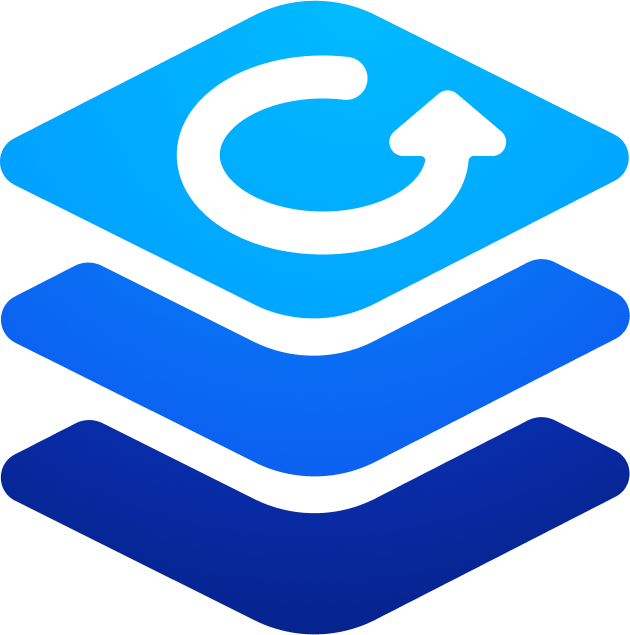

# Welcome to @sap/mdk-mcp-server

[](https://api.reuse.software/info/github.com/sap/mdk-mcp-server)


## What is MCP server for mobile development kit?
This open-source server provides AI agents with comprehensive MDK knowledge and tools. By combining best practice guidelines, project-aware context information, templates for creating new projects, and access to the MDK CLI tools, the MDK MCP server transforms AI agents into MDK development experts.

## What is mobile development kit?
The SAP Mobile Development Kit (MDK) is a powerful framework that enables developers to build cross-platform mobile applications using a metadata-driven approach. It is part of SAP Business Technology Platform and integrates tightly with SAP Mobile Services. 
Some of SAP’s larger and complex mobile apps are built using MDK. An example is [SAP Service and Asset Manager](https://www.sap.com/sea/products/scm/asset-manager.html).

> [!NOTE]
> This MCP server is an early release version of the MDK. You may encounter bugs or unfinished features. We'd love your feedback to make it better! Please report issues or share suggestions via [GitHub issues](https://github.com/sap/mdk-mcp-server/issues).

## Table of Contents

- [Setup](#setup)
  - [Usage in VS Code](#usage-in-vs-code)
  - [Usage in OpenCode](#usage-in-opencode)
  - [Rules](#rules)
  - [Integration with SAP Mobile Services](#integration-with-sap-mobile-services)
- [Available Tools](#available-tools)
- [Support, Feedback, Contributing](#support-feedback-contributing)
- [Security / Disclosure](#security--disclosure)
- [Code of Conduct](#code-of-conduct)
- [Licensing](#licensing)
- [Acknowledgments](#acknowledgments)


## Setup

Assuming you have already installed [node.js](https://nodejs.org/en) on your machine, first install [Yeoman](https://yeoman.io/). This must be an older version to avoid compatibility issues.

```bash
npm i -g yo@4.3.1
```

For installing the MDK MCP server, we offer two options: 

1. Use npm to install it from the public npmjs registry at [@sap/mdk-mcp-server](https://www.npmjs.com/package/@sap/mdk-mcp-server). 
 
    ```bash
    npm install -g @sap/mdk-mcp-server 
    ``` 

2. Clone the open-source code repository at https://github.com/SAP/mdk-mcp-server, and use `npm` to install. 

    ```bash 
    git clone https://github.com/SAP/mdk-mcp-server.git 
    cd mdk-mcp-server 
    npm i --include=optional 
    npm i -g @sap/mdk-mcp-server@. 
    ```

Next, your MCP client (AI agent) needs to be configured to make use of the server. Depending on the AI agent used, the configuration looks a little different. 

### Usage in VS Code

This is an example of [Cline extension](https://marketplace.visualstudio.com/items?itemName=saoudrizwan.claude-dev) in VS Code. You have to configure API Provider and related settings in the API Configuration Settings of Cline extension. The `mcpServers` configuration should include the following section:


```json
    {
      "mcpServers": {
        "mdk-mcp": {
          "type": "stdio",
          "command": "mdk-mcp",
          "args": []
        }
      }
    }
```

### Usage in OpenCode

Example for [OpenCode](https://github.com/sst/opencode):

```json
{
  "mcp": {
    "mdk-mcp": {
      "type": "local",
      "command": ["mdk-mcp"],
      "enabled": true
    }
  }
}
```

### Usage in Cursor

Open file ~/.cursor/mcp.json

```json
{
  "mcpServers": {
    "mdk-mcp": {
      "command": "mdk-mcp",
      "args": []
    },
  }
}
```

Once installed, the AI agent in your IDE will automatically gain access to the MDK MCP server and can start using the tools at its own discretion. Depending on your IDE and settings, you may need to approve the first tool calls.

### Rules

The following rules help guide the agent to use the server correctly. 

```markdown
- Don't generate `.service.metadata` file.
- Don't generate `.xml` file in the `Services` folder.
- Don't change `.project.json` file.
```
Add these rules to your existing global or project-specific [`AGENTS.md`](https://agents.md/) (specifics may vary based on respective MCP client).


### Integration with SAP Mobile Services

For the integration with SAP Mobile Services, the MCP server currently makes use of the Cloud Foundry CLI and a service metadata file that contains details about:
1.	The mobile application defined in the SAP Mobile Services instance.
2.	The OData service metadata of the data source used in the mobile application. This describes the data model and capabilities of the OData service.

An example of such a service metadata file (with filename `.service.metadata`) is provided in our code repository. However, changing this file is not easy. We offer a tool to help with creating or updating this file as part of our **Visual Studio Code extension: Mobile development kit extension for Visual Studio Code**.

How to use this tool to create or update the `.service.metadata` file:
1.	Install [Mobile development kit extension for Visual Studio Code](https://marketplace.visualstudio.com/items?itemName=SAPSE.vsc-extension-mdk) version 1.32.0 or later in your Visual Studio Code.
2.	Make sure you have installed the [Cloud Foundry CLI](https://help.sap.com/docs/btp/sap-business-technology-platform/download-and-install-cloud-foundry-command-line-interface).
3.	Make sure to log in to your SAP Business Technology Platform environment on Cloud Foundry. This can be done by executing  the following command in a terminal window. For more details you can refer to [this help documentation](https://help.sap.com/docs/btp/sap-business-technology-platform/log-on-to-cloud-foundry-environment-using-cloud-foundry-command-line-interface).

    ```bash
    cf login <your target endpoint> --sso
    ```

4. Create a empty project folder in your VS Code workspace.
5. Open the Command Palette in Visual Studio Code and select the **MDK: Open Mobile App Editor** command.
6. Create/Select a new/existing mobile app.
7. Select a destination.
8. Click **Add App to Project** button.

## Available Tools

> [!NOTE]
> Tools are meant to be used by AI models and do not constitute a stable API.

This release of the MDK MCP server includes the following tools, which can be accessed by your AI agent:

| Tools     | Description | Parameters      |
|----------|-----|-----------|
| `mdk-gen-project`    | Generates a new MDK project in the current directory.  | - `folderRootPath:` The path of the current project root folder. <br> -`templateType:` The type of the template to be used. <br> -`oDataEntitySets:` The OData entity sets are relevant to the user prompt, separated by commas. <br> -`offline:` Whether to generate the project in offline mode, set to false unless offline is explicitly specified.  |
| `mdk-gen-i18n`    | Returns a prompt to be used for generating i18n files for the MDK application. You can describe texts, labels, messages.  | - `folderRootPath:` The path of the current project root folder. |
| `mdk-gen-databinding-page`    | Returns a prompt to be used for generating a databinding-enabled MDK page. Using the prompt, a .page file is created that describes the page layout, controls and data bindings.  | - `folderRootPath:` The path of the current project root folder. <br> -`controlType:` The type of the control to be used in the MDK page. |
| `mdk-gen-layout-page`    | Generates a layout-based MDK page. You can describe the page layout, controls. It saves the response to `.page` file.  | - `folderRootPath:` The path of the current project root folder. <br> -`layoutType:` The type of the layout to be used in the MDK page. |
| `mdk-gen-entity`    | Generates CRUD or List Detail template metadata for a new entity set.  | - `folderRootPath:` The path of the current project root folder. <br> -`templateType:` The type of the entity template to be used. <br> -`oDataEntitySets:` The OData entity sets are relevant to the user prompt, separated by commas. |
| `mdk-gen-action`    | Returns a prompt to be used for generating an MDK action. Using the prompt, an `.action` file will be created that describes the action type and data bindings.  | - `folderRootPath:` The path of the current project root folder. <br> -`actionType:` The type of the action. |
| `mdk-build`    | Build an MDK project.  | - `folderRootPath:` The path of the current project root folder. |
| `mdk-deploy`    | Deploy an MDK project to the Mobile Services.  | - `folderRootPath:` The path of the current project root folder. |
| `mdk-show-qrcode`    | Show QR code for an MDK application. | - `folderRootPath:` The path of the current project root folder. |
| `mdk-migrate`    | Migrate an MDK project to the latest MDK version.  | - `folderRootPath:` The path of the current project root folder. |
| `mdk-validate`    | Validate an MDK project. | - `folderRootPath:` The path of the current project root folder. |
| `mdk-search-documentation`    | Returns the top N results from MDK documentation by semantic search, sorted by relevance.  | - `query:` Search query string. <br> -`N:` Number of results to return. |
| `mdk-get-component-documentation`    | Returns the schema of an MDK component based on the name of the component.  | - `component_name:` Name of the component. |
| `mdk-get-property-documentation`    | Returns the documentation of a specific property of an MDK component.  | - `component_name:` Name of the component. <br> -`property_name:` Name of the property. |
| `mdk-get-example`    | Returns an example usage of an MDK component.  | - `component_name:` Name of the component. |
| `mdk-open-mobile-app-editor`    | Instruct how to open the Mobile App Editor to create .service.metadata file.  | None |

## Support, Feedback, Contributing

This project is open to feature requests/suggestions, bug reports, and so on, via [GitHub issues](https://github.com/sap/mdk-mcp-server/issues). Contribution and feedback are encouraged and always welcome. 

These instructions help contributors set up, test, and maintain code quality for this project. All commands should be run from your project folder in a terminal.

- **Test:** `npm test`
- **Build:** `npm run build`  
- **Lint:** `npm run lint:all`

For more information about how to contribute, the project structure, as well as additional contribution information, see our [Contribution Guidelines](CONTRIBUTING.md).


## Security / Disclosure

If you find any bug that may be a security problem, please follow our instructions at [in our security policy](https://github.com/sap/mdk-mcp-server/security/policy) on how to report it. Please don't create GitHub issues for security-related doubts or problems.


## Code of Conduct

We as members, contributors, and leaders pledge to make participation in our community a harassment-free experience for everyone. By participating in this project, you agree to abide by its [Code of Conduct](https://github.com/cap-js/.github/blob/main/CODE_OF_CONDUCT.md) at all times.


## Licensing

Copyright 2025 SAP SE or an SAP affiliate company. Please see our [LICENSE](LICENSE) for copyright and license information. Detailed information including third-party components and their licensing/copyright information is available [via the REUSE tool](https://api.reuse.software/info/github.com/sap/mdk-mcp-server).


## Acknowledgments

- **@huggingface/transformers.js** is used to compare the output of the WordPiece tokenizer.
- **@modelcontextprotocol/sdk** provides the SDK for MCP.
